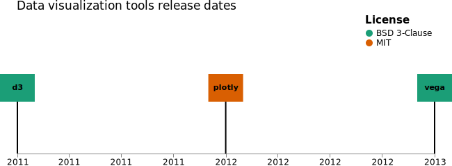

## Vega Timeline Tutorial



Vega introduces a  visualization grammar. A grammar is basically a set of rules that dictate how to use a language, so we can think of Vega as a tool that defines a set of rules of how to build and manipulate visual elements.

Here we'll build a timeline to get a sense of how Vega works.
You can see the timeline live [here](https://vega.github.io/editor/#/url/vega/N4KABGBEAkDODGALApgWwIaQFxUQFzwAdYsB6UgN2QHN0A6agSz0QFcAjOxge1IRQyUa6SgFY6AK1jcAdpAA04KAHdGAExbYwANgAMuxREgpG1fFoBM+w1HiyAZqa2gIRvMgAeeZ0tdR7st44kACSasjoADZgAMroMrDyYACCVDKMAE5gAHKeeEkAEsiRVHiM8Ji+YAC+Nm7Mkcg+fkYBMkFQYRHRcQlJqcjpWblehcWl5Zh1rpBteADqyKbmOKLWVa2BMYwAXk04AIwA7NNGkYyozFoAtAdVtVWQ6B6MsM0tkJHo7MUAYoFaULhKKxeKJFJpTI5PJjErIMoVBQbKBfH6Rf7tbZ7LQHCz3JQPep4RrvNx5QEAEXQeHQYAor1YUV21J4MjAeG43EisDAGWKEVgyDAampyDe00g3AyjEGHUgHMISL8TxkSClgNgNIy3gl9gy6FQ+yg1Ay3FYiolgzs4VJM3NIvctuVag8zkgFCirCNt2qyN9fn9NRskFgphkUTeOAA2lVgJBw4bAXz4At1Joku7PUa1oTXHGE0bIMm8EVljqoB7Il6tAAWXS5iD5g2F4sATQUFazWgAHKIG2AXB8C0nkCmAMKy5AZDvIyCMdJyqPF+ZpxCkCzyNsAamLpbMeHXAF1IPiIIfgw7MFgY35gFBh8Fzux9dKxUqPgEMhgOoOWh88AAnoQhZSLI75-sqhDoBkgpOhBRh8o06CwcEDrIFgADkACkrYYSe8EBn6pydlWb7Rsijbxs22DusIHZFvyyH7JAVgHAAzAonzlIMKGQAAQjEFJgGx1xjl8rCwfIkDhAg0qEGUYFYJAABqwhgK8YC0vSsCMucOwsrIYAmgaGAZEktLhPAXz6mUVBgF8MjUIy1BCp+YDwHyLKOUksDoPS3maTIahgLAiDQfO1Dqe0U7oCmjB2dpunMgpbIyWGbz9reVGJkpagcVJiECsxrEHJx5zwDxzECUJIliegElNFJMkeYw8mspSbFgAAFFSNLXBS0ppGAFLcPArCGu0PJSsNbGSLAACU6k8rSABSfnoDELXyfZjDPtBAFgG5iVMjsEXCtStISWdyjIOwIU0kF0FqBlSQUQO2XMYQkTcMSAGcYVTE0axFhldxCTMQAsiEAAqnHNXJKU0QACt9v1zUtgVgNwwFstIrAZBVYBrR6m0Izte0ZAdbkeREZSOUZ+qEIgy1BedoXsNwT0ZW956zng+oJJ+qBaDeEG-hB8pAYWdiRI0KbgRL0jam6jjFGogLDoGf5a64h6nmAvNGAgURkWAouNrOD5QB4m0mwrbhS4CZSJsR0ncBg85upegJPi+MrirMMqROrwQA7BmVQALLmAqoGiIPb97cYCAERNO9zTOLRhW5AMtSrbJKu4BwGAlKajzlECdux7cg4HG3uPrtftvhmqvBz7YPh67UdGnG-BoIWIoZAA1iDOuBobUDPGR5sDrOxsksENsVAXs5SjK7SAhzBDu5XQvUoCOH4a44-BqZQ+RjPmdQEXLajjqlvUaHd-xNQjTirOeo77X0kXe3FP+5ACOkArTcBtLXN6wDorTnAQRFQq43ShmoOGSII4UwrjjoA4iyoTD7gQWGCuT8Ux7nMBHZUroYGwKgIg5BGpl7IC6hhJeJsMLyAdONOgYdkDzWuMuVc64j7wVITMP639qEEMjnfdsQjWiMFlnBP8IZ8EoOCPPehGFc4ZHzsgFh508DsPKpVeaAiILSOvpySIZRFSiKUYCYAGEKRii2ilDCOA2GoDoPDVqKVqiALekIyA9pRTyJmI4WWAB5KC8BmAiPepWashwdYBiwbgbgVBoGz1gYHcJkTolujiUaXQdA+x+L9OnWMfNHbBHcF4Su2dUTFHfgoz+wtv71wkSmF+b9MGzhAWAjJEtJzpKvsqapP5FFIPET-PR7i3F0E1skow5D+mZLEcoqAsyPA7jvhOKBUZdDHjekkw5UAYm9xsYQvAOz3AZCjAcY8pinjnCQXkrswQKpQO6Zk9gTFzgyB7pmUigJLhqDUCSB5cxFhlheYC4IHM27gtkWsuM+TN5fHgEPXxgiiKznnNc2KtkjT2AjMgMpt4KnF1DqwFeTTTQtPem0z43wGmfI+L0nuEDBnBMWXgiZaypnsNdA8jwINrG8sBBsll8FICnPGTQ1C1J2EAS2eOQZezDzXFEJKiWAERXvVWYCHBJCFlUP5twIeyB0GaG-iinAFhEnH1KYRM8wZGguSCpGM25SFFlGJIWAAMh3RqH9EWAg0Voyua9ZQa1kEGhRbLgnygaOyzJgTHQUMyXMLE-ybVgAOMU2B9qID+PqdyLlUBU3JsobMLYuxs2vNzXa45hagwQNdYMEOyyJYVrLdy619a1j1ibSU7W+s9a+iAA)

## Step 1: the data
We can define data directly in a specification (like we are doing using the "values" property) or load data from an external file (json or csv for example) using the "url" property.

Besides loading the data we can also filter, calculate new fields or derive new data streams using Vega Transforms. We can sort the items by name using the collect transform
```
"data": [
    {
      "name": "libraries",
      "format": {
        "type": "json",
        "parse": {
          "release": "date:'%Y'"
        }
      },
      "values": [
        {
          "name": "vega",
          "release": "2013",
          "license": "BSD 3-Clause",
          "description": "Vega is a visualization grammar, a declarative language for creating, saving, and sharing interactive visualization designs"
        },
        {
          "name": "d3",
          "release": "2011",
          "license": "BSD 3-Clause",
          "description": "D3 (Data-Driven Documents or D3.js) is a JavaScript library for visualizing data using web standards"
        },
        {
          "name": "plotly",
          "release": "2012",
          "license": "MIT",
          "description": "Plotly.js is an open source JavaScript library for creating graphs and dashboards"
        }
      ],
      "transform": [
        {
          "type": "collect",
          "sort": {
            "field": "name"
          }
        }
      ]
    }
  ]
```

## Step 2: scales
Vega scales are provided by the d3-scale library. We specify the type of scale with the "type" keyword (default is linear). Scale domains can be specified in multiple ways:
* A data reference object that specifies field values in one or more data sets, like we are doing with {"data": "our_data", "field": "amount"}. Vega computes the [min,max] array of the amount key from the dataset
* As a literal array of domain values
* A signal reference that resolves to a domain value array.
```
"scales": [
    {
      "name": "xScale",
      "type": "time",
      "domain": {
        "data": "libraries",
        "field": "release"
      },
      "range": "width",
      "nice": "year"
    },
    {
      "name": "colorScale",
      "type": "ordinal",
      "domain": {
        "data": "libraries",
        "field": "license"
      },
      "range": {
        "scheme": "dark2"
      }
    }
  ]
```

## Step 3: axes
Here we need to specify the orientation and the scale that should be used to create the axis. There are a lot of properties we can use to customize them. Let's place an axis in the bottom and show the year in the labels:

```
"axes": [
    {
      "scale": "xScale",
      "orient": "bottom",
      "format": "%Y"
    }
  ]
```

## Step 4: marks
We use marks to encode data using geometric primitives (rectangles, circles, lines and so on). In this bar chart we are using the Rect mark. They need a given position, width, and height. We also need to specify what data should be used to build the marks (the "from" property). All the definitions for things like "x", "y" and "width" will come from this dataset. Vega Types might look a little confusing at first, so let's go through some common ones:
```
"x": {"scale": "xscale", "field": "category"}
```
The "x" property for the rects will be set by the passing the values from "category" field to the "xscale".
```
"y": {"scale": "xscale", "band": 1}
```
The "y" property for each rect will be the range band width of the band scale xscale.
```
"fill": {"value": "steelblue"}
```
The "fill" color of the rects will be steelblue. To define constant values we use the "value" property.

Vega uses the same enter, update, exit pattern that d3 uses. We use this pattern inside the "encode" property.

There are three marks in the timeline: the rectangles, the text inside the rectangles and the line from each rectangle to the axis. We'll use "rect", "text" and "rule" marks to define each of them.
But first let's introduce an important Vega property: Signals.

❗️Signals
Signals are dynamic variables. As the documentation says, the signal values are reactive: they can update in response to input event streams, external API calls, or changes to upstream signals. Here we'll use them with initial values, but their power comes from being able to update them (we'll see how to do that another time).
Now that we have the signals we can use them to place the marks. Signals can also hold Vega expressions.

In this example we'll use an expression to place the rectangles in the middle of each year with this expression:
```
"signal": "scale('xScale',datum.release)-rectWidth/2"
         //scale(name, value[,group]
```

As we saw earlier, we need to specify what data should be used to build the marks with the "from" property. Vega is so great that we can specify the data from another mark itself! In this case, we'll use the data from the rect marks so we can get the center for each rectangle and place the text in the middle. To access the data points we use "datum" inside the expression.
```
"marks": [
    {
      "type": "rect",
      "name": "rectangles",
      "from": {
        "data": "libraries"
      },
      "encode": {
        "enter": {
          "width": {
            "signal": "rectWidth"
          },
          "height": {
            "signal": "rectHeight"
          },
          "x": {
            "signal": "scale('xScale',datum.release)-rectWidth/2"
          },
          "y": {
            "signal": "rectY"
          },
          "fill": {
            "signal": "scale('colorScale', datum.license)"
          },
          "tooltip": {
            "signal": "{'Description': datum.description}"
          }
        },
        "update": {
          "fillOpacity": {
            "value": 1
          }
        },
        "hover": {
          "fillOpacity": {
            "value": 0.5
          }
        }
      }
    },
    {
      "type": "text",
      "name": "labels",
      "from": {
        "data": "rectangles" // ⬅️cool
      },
      "encode": {
        "enter": {
          "text": {
            "signal": "datum.datum.name"
          },
          "x": {
            "signal": "datum.x+rectCenter[0]" //datum.x is from rect
          },
          "y": {
            "signal": "rectCenter[1]"
          },
          "align": {
            "value": "center"
          },
          "baseline": {
            "value": "middle"
          },
          "fontWeight": {
            "value": "bold"
          },
          "fill": {
            "value": "black"
          }
        }
      },
      "interactive": false
    },
    {
      "type": "rule",
      "from": {
        "data": "labels" // ⬅️cool
      },
      "encode": {
        "enter": {
          "x": {
            "signal": "datum.x"
          },
          "x2": {
            "signal": "datum.x"
          },
          "y": {
            "signal": "datum.y+rectCenter[0]-5"
          },
          "y2": {
            "signal": "height"
          },
          "strokeWidth": {
            "value": 2
          }
        }
      }
    }
  ]
```
## Step 5: legends
Legends definitions are similar to mark definitions. To customize is the addressable elements are:
* legend for the legend group mark,
* title for the title text mark,
* labels for label text marks,
* symbols for legend symbol marks,
* entries for symbol legend group marks containing a symbol / label pair, and
* gradient for a gradient rect marks: one rect with gradient fill for continuous gradient legends, multiple rect marks with solid fill for discrete gradient legends.

Here we'll only set the "x" position for the legend (the whole group) and set the fontSize for the title and the labels.

```
"legends": [
    {
      "title": "License",
      "fill": "colorScale",
      "orient": "none",
      "encode": {
        "title": {
          "update": {
            "fontSize": {
              "value": 15
            }
          }
        },
        "labels": {
          "update": {
            "fontSize": {
              "value": 12
            }
          }
        },
        "legend": {
          "update": {
            "x": {
              "value": 500
            }
          }
        }
      }
    }
  ]
```

## Step 6: config and title
The config object defines default visual values to set a visualization's theme. Here we are setting the typefaces for the text of the graph. The title directive adds a descriptive title to a chart.

```
"config": {
    "text": {
      "font": "Ideal Sans, Avenir Next, Helvetica"
    },
    "title": {
      "font": "Ideal Sans, Avenir Next, Helvetica",
      "fontWeight": 500,
      "fontSize": 17,
      "limit": -1
    },
    "axis": {
      "labelFont": "Ideal Sans, Avenir Next, Helvetica",
      "labelFontSize": 12
    }
  },
"title": {
    "text": "Data visualization tools release dates",
    "orient": "top",
    "anchor": "start",
    "frame": "group",
    "encode": {
      "update": {
        "dx": {
          "value": -1
        }
      }
    }
  }
```
And we are done! You can see the timeline live [here](https://vega.github.io/editor/#/url/vega/N4KABGBEAkDODGALApgWwIaQFxUQFzwAdYsB6UgN2QHN0A6agSz0QFcAjOxge1IRQyUa6SgFY6AK1jcAdpAA04KAHdGAExbYwANgAMuxREgpG1fFoBM+w1HiyAZqa2gIRvMgAeeZ0tdR7st44kACSasjoADZgAMroMrDyYACCVDKMAE5gAHKeeEkAEsiRVHiM8Ji+YAC+Nm7Mkcg+fkYBMkFQYRHRcQlJqcjpWblehcWl5Zh1rpBteADqyKbmOKLWVa2BMYwAXk04AIwA7NNGkYyozFoAtAdVtVWQ6B6MsM0tkJHo7MUAYoFaULhKKxeKJFJpTI5PJjErIMoVBQbKBfH6Rf7tbZ7LQHCz3JQPep4RrvNx5QEAEXQeHQYAor1YUV21J4MjAeG43EisDAGWKEVgyDAampyDe00g3AyjEGHUgHMISL8TxkSClgNgNIy3gl9gy6FQ+yg1Ay3FYiolgzs4VJM3NIvctuVag8zkgFCirCNt2qyN9fn9NRskFgphkUTeOAA2lVgJBw4bAXz4At1Joku7PUa1oTXHGE0bIMm8EVljqoB7Il6tAAWXS5iD5g2F4sATQUFazWgAHKIG2AXB8C0nkCmAMKy5AZDvIyCMdJyqPF+ZpxCkCzyNsAamLpbMeHXAF1IPiIIfgw7MFgY35gFBh8Fzux9dKxUqPgEMhgOoOWh88AAnoQhZSLI75-sqhDoBkgpOhBRh8o06CwcEDrIFgADkACkrYYSe8EBn6pydlWb7Rsijbxs22DusIHZFvyyH7JAVgHAAzAonzlIMKGQAAQjEFJgGx1xjl8rCwfIkDhAg0qEGUYFYJAABqwhgK8YC0vSsCMucOwsrIYAmgaGAZEktLhPAXz6mUVBgF8MjUIy1BCp+YDwHyLKOUksDoPS3maTIahgLAiDQfO1Dqe0U7oCmjB2dpunMgpbIyWGbz9reVGJkpagcVJiECsxrEHJx5zwDxzECUJIliegElNFJMkeYw8mspSbFgAAFFSNLXBS0ppGAFLcPArCGu0PJSsNbGSLAACU6k8rSABSfnoDELXyfZjDPtBAFgG5iVMjsEXCtStISWdyjIOwIU0kF0FqBlSQUQO2XMYQkTcMSAGcYVTE0axFhldxCTMQAsiEAAqnHNXJKU0QACt9v1zUtgVgNwwFstIrAZBVYBrR6m0Izte0ZAdbkeREZSOUZ+qEIgy1BedoXsNwT0ZW956zng+oJJ+qBaDeEG-hB8pAYWdiRI0KbgRL0jam6jjFGogLDoGf5a64h6nmAvNGAgURkWAouNrOD5QB4m0mwrbhS4CZSJsR0ncBg85upegJPi+MrirMMqROrwQA7BmVQALLmAqoGiIPb97cYCAERNO9zTOLRhW5AMtSrbJKu4BwGAlKajzlECdux7cg4HG3uPrtftvhmqvBz7YPh67UdGnG-BoIWIoZAA1iDOuBobUDPGR5sDrOxsksENsVAXs5SjK7SAhzBDu5XQvUoCOH4a44-BqZQ+RjPmdQEXLajjqlvUaHd-xNQjTirOeo77X0kXe3FP+5ACOkArTcBtLXN6wDorTnAQRFQq43ShmoOGSII4UwrjjoA4iyoTD7gQWGCuT8Ux7nMBHZUroYGwKgIg5BGpl7IC6hhJeJsMLyAdONOgYdkDzWuMuVc64j7wVITMP639qEEMjnfdsQjWiMFlnBP8IZ8EoOCPPehGFc4ZHzsgFh508DsPKpVeaAiILSOvpySIZRFSiKUYCYAGEKRii2ilDCOA2GoDoPDVqKVqiALekIyA9pRTyJmI4WWAB5KC8BmAiPepWashwdYBiwbgbgVBoGz1gYHcJkTolujiUaXQdA+x+L9OnWMfNHbBHcF4Su2dUTFHfgoz+wtv71wkSmF+b9MGzhAWAjJEtJzpKvsqapP5FFIPET-PR7i3F0E1skow5D+mZLEcoqAsyPA7jvhOKBUZdDHjekkw5UAYm9xsYQvAOz3AZCjAcY8pinjnCQXkrswQKpQO6Zk9gTFzgyB7pmUigJLhqDUCSB5cxFhlheYC4IHM27gtkWsuM+TN5fHgEPXxgiiKznnNc2KtkjT2AjMgMpt4KnF1DqwFeTTTQtPem0z43wGmfI+L0nuEDBnBMWXgiZaypnsNdA8jwINrG8sBBsll8FICnPGTQ1C1J2EAS2eOQZezDzXFEJKiWAERXvVWYCHBJCFlUP5twIeyB0GaG-iinAFhEnH1KYRM8wZGguSCpGM25SFFlGJIWAAMh3RqH9EWAg0Voyua9ZQa1kEGhRbLgnygaOyzJgTHQUMyXMLE-ybVgAOMU2B9qID+PqdyLlUBU3JsobMLYuxs2vNzXa45hagwQNdYMEOyyJYVrLdy619a1j1ibSU7W+s9a+iAA).
There are some other cool Vega features that we didn't see in this tutorial:
* Triggers: Modify data sets or mark properties in response to signal values
* Projections: Cartographic projections to map (longitude, latitude) data
* Event Streams: Define input event streams to specify interactions
* Layout: Perform grid layout for a collection of group marks


